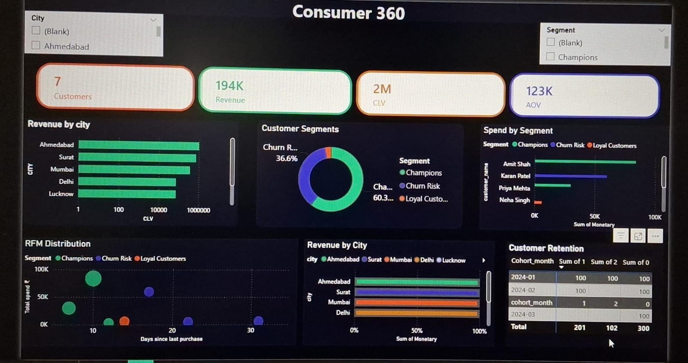

# 📊 Consumer 360 Analytics Project

## 📌 Project Overview

This project analyzes customer data using SQL, Python, and Power BI.
It helps in understanding customer behavior, segmentation, and business insights.

---

## 🎯 Objectives

* Identify high-value customers
* Analyze churn risk
* Calculate customer lifetime value (CLV)
* Perform cohort analysis
* Perform market basket analysis

---

## 🛠 Tools Used

* SQL
* Python
* Power BI

---

## 📂 Project Files

* SQL file for database creation
* Python script for analysis
* CSV files (output data)
* Power BI dashboard

---

## 📊 Dashboard Preview

---

## 🔍 Key Insights

* Champions customers generate highest revenue
* Churn risk customers identified
* Customer retention analyzed using cohort

---

## 🚀 How to Use

1. Run SQL file
2. Run Python file
3. Open Power BI dashboard

---

## 📌 Conclusion

This project shows complete data analysis from raw data to insights.
